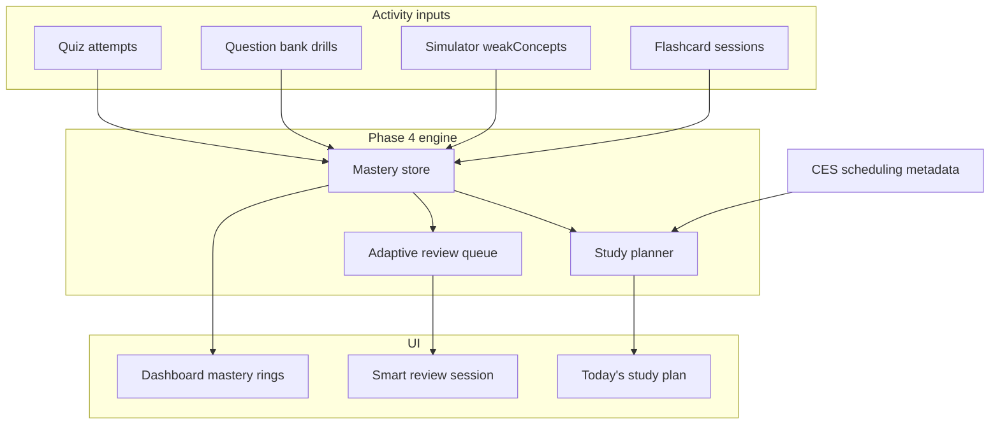

# Phase 4 — Learning Intelligence

**Status:** Complete  
**Depends on:** CES fields populated, especially `estimatedStudyMinutes`, `difficulty`, `prerequisites`, `questionBank`

---

## Goal

Transform Bridge from a structured study app into an **adaptive certification platform** that knows what the learner has mastered, what is decaying, and what to study today — without requiring AI.

## User value

- Learners see real mastery per topic/objective, not just completion checkmarks
- Review queue surfaces the right content at the right time (spaced repetition)
- Study planner builds daily sessions from exam date, time budget, and topic difficulty

---

## Architecture overview



---

## Part 1 — Mastery model (P4-Mastery)

### Data model (`src/types/mastery.ts`)

```typescript
export type MasteryLevel = "new" | "learning" | "familiar" | "proficient" | "mastered";

export interface TopicMastery {
  topicKey: string;
  certId: string;
  score: number;           // 0–100 composite
  level: MasteryLevel;
  objectiveScores: Record<string, number>;  // objective ID → 0–100
  lastPracticedAt: string;
  nextReviewAt: string;    // SRS due date
  attemptCount: number;
  streak: number;          // consecutive passing sessions
}

export interface StudyPlanPreferences {
  examDate: string | null;       // ISO date
  weeklyMinutes: number;         // default 300
  activeCertIds: string[];
}
```

Extend `ProgressState`:

```typescript
topicMastery: Record<string, TopicMastery>;
studyPlan: StudyPlanPreferences;
reviewQueue: string[];  // topicKeys ordered by priority
```

**localStorage:** bump persist version to `bridge-study-progress-v2` with migration from v1.

### Scoring algorithm (`src/lib/mastery.ts`)

Composite topic score from weighted signals:

| Signal | Weight | Source |
|--------|--------|--------|
| Recent quiz accuracy | 40% | Last 3 quiz attempts on topic |
| Question bank accuracy | 25% | Bank drill attempts |
| Simulator score | 20% | Best recent sim % minus weakConcepts penalty |
| Flashcard retention | 15% | Last session % got-it |

**Level thresholds:** new 0–19, learning 20–49, familiar 50–69, proficient 70–89, mastered 90+

**Objective scores:** map each quiz/bank question to topic `objectives[]` via question ID prefix or explicit `objectiveId` field (add optional `objectiveId?: string` to `QuizQuestion` in Phase 4).

### UI surfaces

- Cert page: mastery ring per domain (% topics at proficient+)
- Lesson page: mastery badge on topic
- Progress page: mastery breakdown per cert

### Agent: P4-Mastery

**Owns:** `src/types/mastery.ts`, `src/lib/mastery.ts`, `src/stores/progress-store.ts` (mastery slice), migration util

**Must not:** build planner or adaptive UI yet

---

## Part 2 — Adaptive review (P4-Adaptive)

### Depends on

- TopicMastery with `nextReviewAt`
- Expanded `questionBank` pools

### SRS algorithm (`src/lib/adaptive-review.ts`)

Simplified SM-2 variant:

- On pass (≥80%): increase interval (1d → 3d → 7d → 14d → 30d)
- On fail: reset interval to 1d, bump severity
- Due topics = `nextReviewAt <= today`

### Review session builder

`buildReviewSession(certId, state, maxQuestions)`:

1. Pull due topics from review queue (sorted by overdue days × severity)
2. For each topic, select questions from `questionBank` by mastery level:
   - learning → easier questions (first half of bank or tagged easy when tags exist)
   - familiar → mixed
   - proficient → harder / trap-heavy
3. Cap session at 15–25 questions mobile-friendly

### Route

`/review/session` — new adaptive review flow (replaces static weak-area list as primary CTA; keep weak list as secondary)

### Question difficulty (Phase 4a vs 4b)

- **4a:** positional heuristic (first 40% of bank = easier) — no schema change
- **4b:** add optional `difficulty?: "easy" | "medium" | "hard"` to `QuizQuestion`

### Agent: P4-Adaptive

**Owns:** `src/lib/adaptive-review.ts`, review session route + component, dashboard "Review due" CTA

---

## Part 3 — Study planner (P4-Planner)

### Depends on

- Mastery scores
- CES `estimatedStudyMinutes`, `difficulty`, `prerequisites`

### Planner algorithm (`src/lib/study-planner.ts`)

`buildDailyPlan(state, certs, date)`:

1. Read `studyPlan.examDate` and `weeklyMinutes` → daily budget
2. Compute days until exam; remaining curriculum steps per active cert
3. Priority queue:
   - Overdue SRS reviews (from adaptive)
   - Weak areas (severity 3)
   - Next incomplete curriculum step (existing `getNextCurriculumStep`)
   - Topics with prerequisites satisfied, sorted by exam weight / difficulty
4. Pack items into daily budget using `estimatedStudyMinutes`
5. Return ordered list of `CurriculumStep` + review blocks

### UI

- Dashboard: **Today's Study Plan** card (replace/enhance `getTodaysStudyItem`)
- Settings sheet: exam date picker, weekly minutes slider, active certs toggle
- `/progress` — plan adherence (completed vs planned)

### Agent: P4-Planner

**Owns:** `src/lib/study-planner.ts`, settings UI, dashboard plan card

---

## Execution order

```text
P4-Mastery → P4-Adaptive → P4-Planner → P4-Verify
```

Parallel content (optional during P4): tag question bank items with difficulty (P4b-Content agents per cert).

---

## Completion criteria

- [ ] Mastery scores update after quiz, bank drill, sim, flashcards
- [ ] Migration preserves v1 progress
- [ ] Adaptive review session pulls due topics with bank questions
- [ ] Daily plan respects time budget and exam date
- [ ] Dashboard shows plan + mastery at a glance
- [ ] `npm run build` passes
- [ ] No AI dependencies

---

## Risks

| Risk | Mitigation |
|------|------------|
| localStorage migration data loss | v1→v2 migrator with fallback; export reset option |
| questionBank too small for adaptive | positional heuristic in 4a; expand banks in 3b |
| Planner overload on mobile | cap 3–5 items per day default |
| Objective mapping incomplete | start topic-level; objective-level in 4b |

---

## Out of scope (Phase 5+)

- In-app AI modes — spec in [`docs/phase-5-ai-learning.md`](docs/phase-5-ai-learning.md); Professor Mode validated externally first
- Cloud sync
- Native apps
- Community / instructor tools
